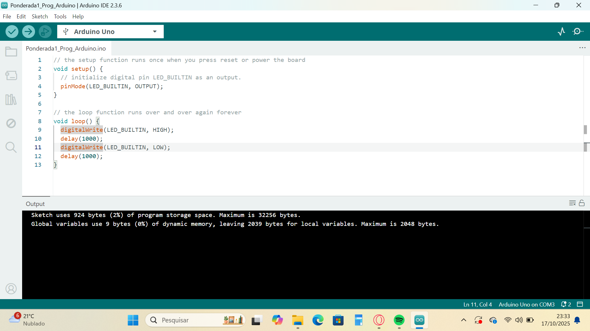
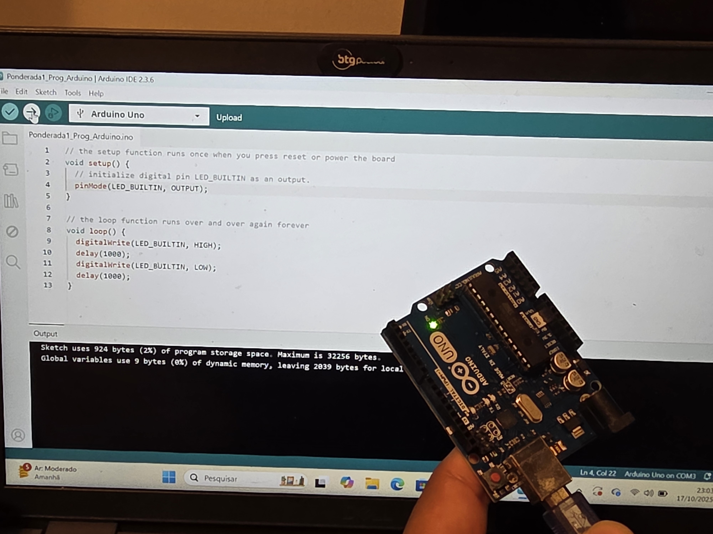
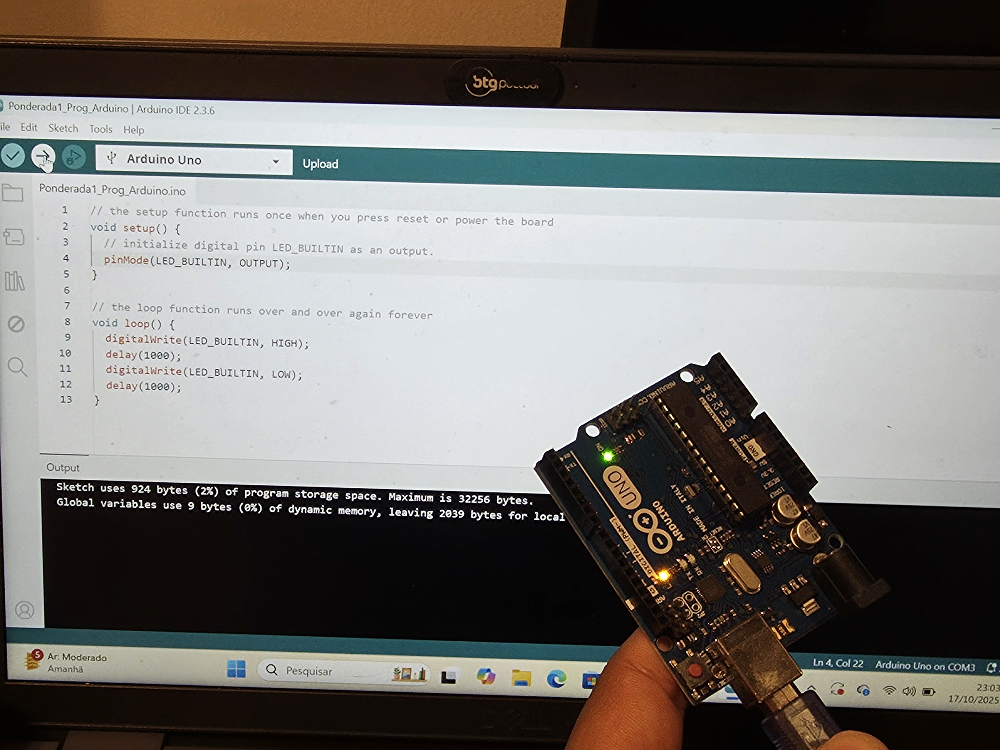
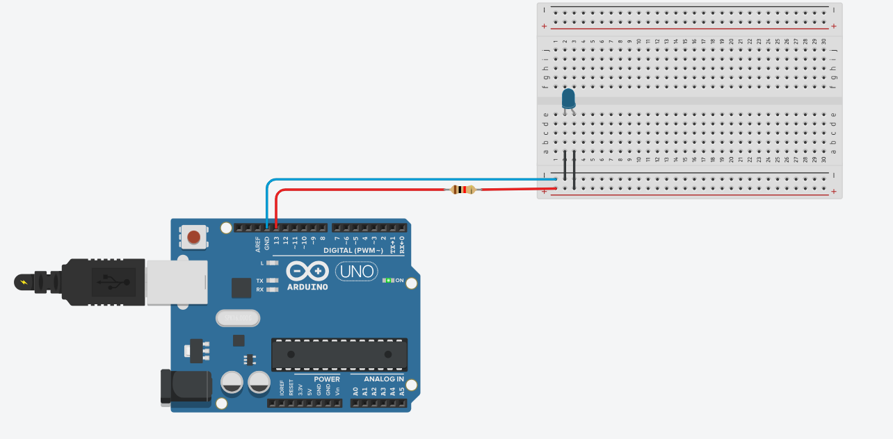

# Projeto Arduino – Blink LED Interno e Simulação de Blink Externo

---

### Pré-requisitos
- Arduino IDE instalada no computador  
- Tinkercad
- um Arduino UNO

---

## Parte 1: Blink LED Interno

#### Descrição
Nesta primeira etapa, o objetivo é programar o LED interno do Arduino para piscar em intervalos definidos, criando um ciclo contínuo, como o comando "void loop()" sugere.

---

#### Código Fonte
```c
//Aqui fazemos as configurações iniciais para exeução.
void setup() {
  // No caso, estamos definindo que o Led com um "L" ao lado será nossa saída o "OUTPUT".
  pinMode(LED_BUILTIN, OUTPUT);
}

//Já aqui colocamos o que acontecerá, utilizando de um loop, ou seja, a ação ficará repetindo varias vezes.
//No caso queremos que o led pisque, para isso definimos um tempo de intervalo entre a ação de piscar e apagar.
void loop() {
  digitalWrite(LED_BUILTIN, HIGH);
  delay(1000);
  digitalWrite(LED_BUILTIN, LOW);
  delay(1000);
}
```

---

#### Fotos do IDE e do arduino


*Figura 1 – Tela do Arduino IDE com o mesmo código já mostrado*


*Figura 2 – O arduino com o led apagado, aguardando o tempo de delay*

 
*Figura 3 – O arduino com o led ligado, aguardando o tempo de delay*

---

#### Vídeos do arduino funcionando

[Assista ao vídeo de demonstração](images\vídeo_arduino.mp4)

---

### Parte 2: Blink LED Externo

#### Descrição
Nesta parte mudamos nosso obejtivos, agora queremos fazer o led externo piscar. Para que isso seja possível usarei o simulador do Tikercad para entender o circuito que utilizarei e depois farei no arduino.

#### Código Fonte
```c
void setup() {
  //No caso dessa parte utilizarei a porta 13
  pinMode (13, OUTPUT);
}

void loop() {
  digitalWrite(13, HIGH);
  delay(1000);
  digitalWrite(13, LOW);
  delay(1000);
}
```

#### Simulação no Tikercad


*Figura 4 - Tela do Tinkercad para simular o arduino com uma protoboard com o led desligado*


*Figura 5 - Tela do Tinkercad para simular o arduino com uma protoboard com o led ligado*


